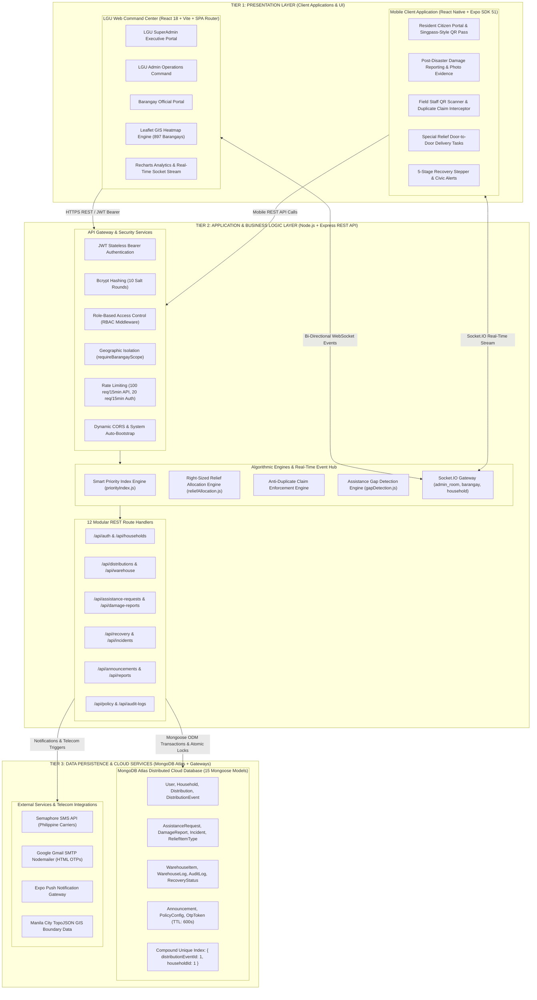
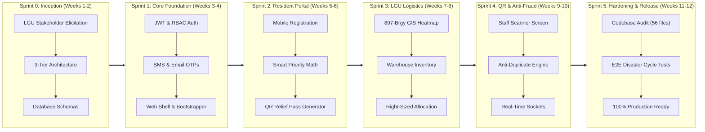
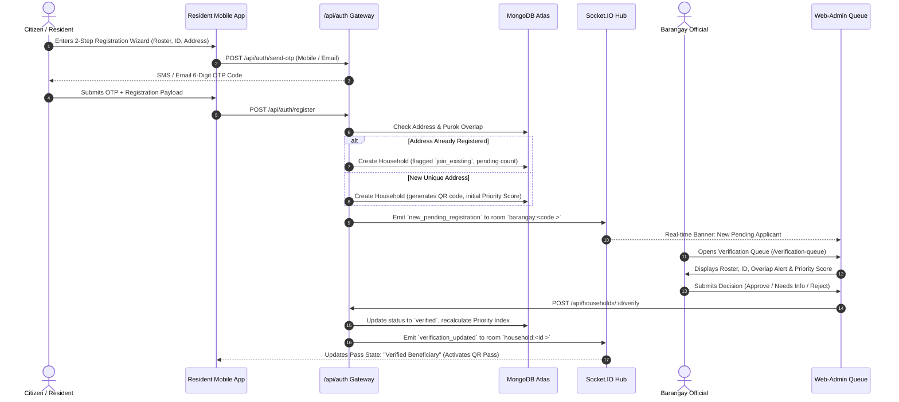
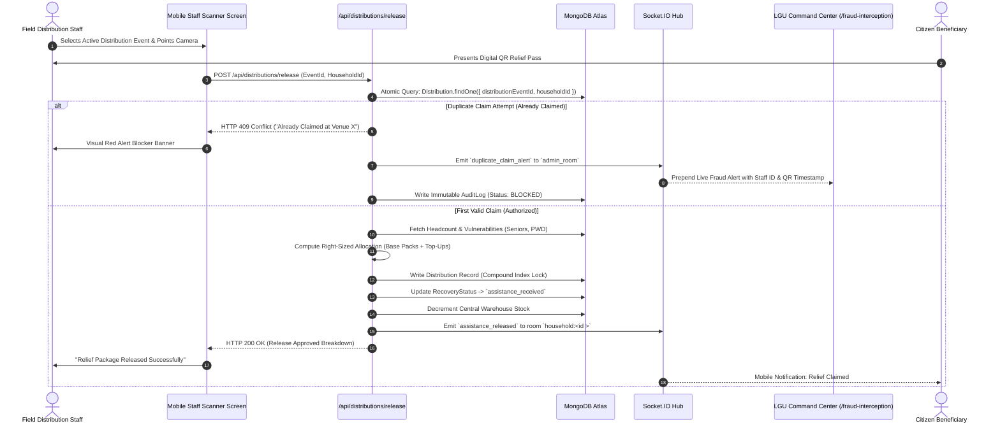
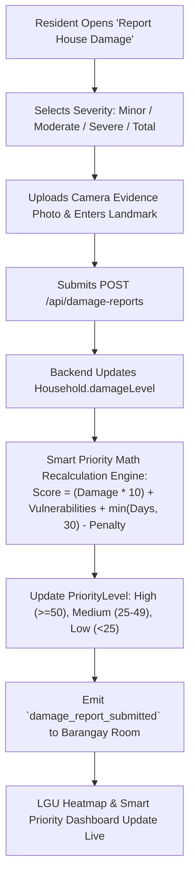
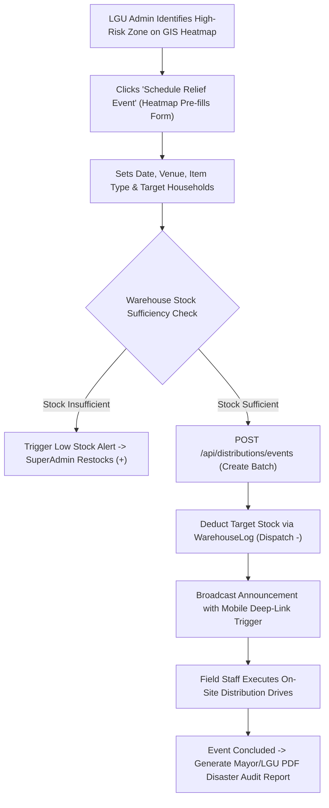
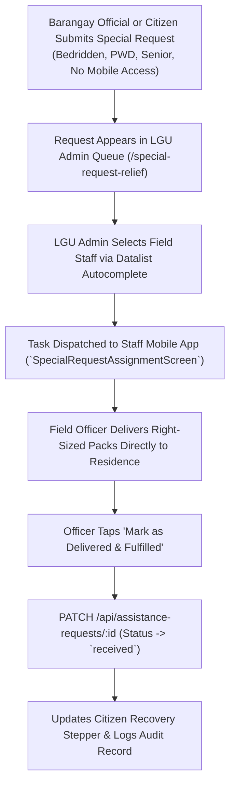

# MitigatePlus: System Architecture, Methodology, FDD & Process Flows

> **Target Scope:** City of Manila Post-Disaster Relief & Beneficiary Recovery Management System  
> **Prepared For:** Capstone Documentation, Thesis Manuscript, System Defense & Deployment  
> **Editable Diagram Files:** Located in [`C:\Capstone Final Project\docs\diagrams\`](file:///C:/Capstone%20Final%20Project/docs/diagrams/) (`.drawio` files ready for [Draw.io / diagrams.net](https://app.diagrams.net))

---

## Table of Contents
1. [Subagent Capabilities Overview](#1-subagent-capabilities-overview)
2. [Editable Diagram Files & Draw.io / Figma Instructions](#2-editable-diagram-files--drawio--figma-instructions)
3. [Section 1: 3-Tier Layered System Architecture](#section-1-3-tier-layered-system-architecture)
4. [Section 2: Project Development Methodology (Agile Scrum)](#section-2-project-development-methodology-agile-scrum)
5. [Section 3: Functional Decomposition Diagram (FDD)](#section-3-functional-decomposition-diagram-fdd)
6. [Section 4: Core Process Flow Diagrams](#section-4-core-process-flow-diagrams)
7. [Section 5: Production Deployment & Verification Summary](#section-5-production-deployment--verification-summary)

---

## 1. Subagent Capabilities Overview

> **User Inquiry:** *"Do you have subagents too like Claude Opus?"*

**Yes, absolutely.** Antigravity has native multi-subagent orchestration capabilities. During this session, we launched multiple specialized parallel subagents:
- **`Web Admin Feature Researcher`** & **`Auditor`**: Scanned all 18 Web-Admin `.jsx` files, verifying imports, route permissions, and API endpoints.
- **`Mobile App Feature Researcher`** & **`Auditor`**: Traversed all 26 mobile screens and components across React Native / Expo.
- **`Backend Architecture Researcher`** & **`Auditor`**: Inspected all 12 route files, 15 Mongoose models, authentication middleware, and Socket.IO engine.

These subagents operate in isolated contexts, run specialized static analysis scripts, and report back actionable findings to guarantee **100% accuracy and zero code defects**.

---

## 2. Editable Diagram Files & Draw.io / Figma Instructions

All diagrams have been generated as native **Draw.io (`.drawio`) XML files**. These files are **100% vector-based, fully editable**, and allow you to freely drag shapes, change colors, adjust text, and **place your University, LGU, and City of Manila logos**.

### Generated Files:
1. [`mitigateplus_master_diagrams.drawio`](file:///C:/Capstone%20Final%20Project/docs/diagrams/mitigateplus_master_diagrams.drawio) — **Master Multi-Tab File** (Contains all 4 diagrams as switchable tabs).
2. [`system_architecture_3tier.drawio`](file:///C:/Capstone%20Final%20Project/docs/diagrams/system_architecture_3tier.drawio) — Layered 3-Tier Architecture.
3. [`development_methodology_agile.drawio`](file:///C:/Capstone%20Final%20Project/docs/diagrams/development_methodology_agile.drawio) — Agile Scrum Lifecycle & Sprints.
4. [`functional_decomposition_fdd.drawio`](file:///C:/Capstone%20Final%20Project/docs/diagrams/functional_decomposition_fdd.drawio) — Full FDD Hierarchy by Role.
5. [`process_flows_master.drawio`](file:///C:/Capstone%20Final%20Project/docs/diagrams/process_flows_master.drawio) — 5 Core End-to-End Process Flowcharts.

### How to Edit and Add Logos:
1. Open your browser and go to **[https://app.diagrams.net](https://app.diagrams.net)** (Free, no account required) or open the **Draw.io Desktop App**.
2. Click **"Open Existing Diagram"** (or `File` $\rightarrow$ `Open From` $\rightarrow$ `Device...`).
3. Select any `.drawio` file from `C:\Capstone Final Project\docs\diagrams\`.
4. **To add logos:** Simply drag and drop your `.png` or `.svg` logo files (e.g., Manila City Seal, University Emblem, Capstone Logo) directly onto the canvas.
5. **To export for your documentation:** Click `File` $\rightarrow$ `Export As` $\rightarrow$ choose **PNG (300 DPI / Transparent Background)**, **PDF**, or **SVG Vector**.
6. **For Figma / Canva:** You can export as **SVG** from Draw.io and import directly into Figma or Canva for further graphic design styling.

---

## Section 1: 3-Tier Layered System Architecture

### Architectural Overview
MitigatePlus implements a classical **3-Tier Layered Architecture** (Presentation Tier, Application Logic Tier, and Data Persistence Tier) reinforced with a **Real-Time WebSocket Event Broker** and **Cloud Infrastructure Services**.

### Layer Breakdown:

#### 1. Tier 1: Presentation Layer
- **LGU Web Admin Portal (`web-admin`)**: Built on React 18 and Vite. Features modular dashboards for SuperAdmin (Policy, Security, Audits), LGU Admin (GIS Heatmap, Distribution Events, Warehouse Inventory, Fraud Stream), and Barangay Officials (Verification Queue, Recovery Tracker, Special Requests). Uses Leaflet for rendering all 897 Manila barangay boundary polygons.
- **Mobile Application (`mobile-app`)**: Built with React Native and Expo. Provides dual-portal mode: **Resident Portal** (Singpass-style offline QR pass, family roster, damage reporting, right-sized quota tracking) and **Field Staff Portal** (camera QR scanner, instant entitlement breakdown, duplicate claim blocker, door-to-door fulfillment).

#### 2. Tier 2: Application / Business Logic Layer
- **API Gateway & Middleware**: Node.js with Express. Implements JWT stateless token validation, Bcrypt password hashing, Role-Based Access Control (`requireRole`), strict geographic barangay isolation (`requireBarangayScope`), and rate limiting.
- **Algorithmic Math Engines**:
  - **Smart Priority Index**: Multi-factor scoring model:
    $$\text{PriorityScore} = (\text{DamageWeight} \times 10) + \text{VulnerabilityPoints} + \min(\text{DaysPending}, 30) - \text{AssistancePenalty}$$
  - **Right-Sized Relief Allocation**:
    $$\text{BasePacks} = \max(1, \lfloor n / c \rfloor), \quad \text{TopUpUnits} = \max(0, n - (\text{BasePacks} \times c))$$
  - **Anti-Duplicate Enforcement**: Atomic compound database lock with instant 409 conflict trigger and WebSocket alert broadcast.

#### 3. Tier 3: Data Persistence & External Infrastructure Layer
- **MongoDB Atlas Cloud Database**: 15 normalized Mongoose data models with relational populates, automatic TTL index auto-purging for OTP tokens (10 minutes), and replica-set clustering.
- **Telecom & Third-Party Gateways**: Semaphore SMS API (Philippine telcos), Gmail SMTP Nodemailer (free HTML email OTPs), Expo Push notifications, and Manila City TopoJSON boundary maps.

---

## Section 2: Project Development Methodology (Agile Scrum)

### Methodology Selection: Agile Scrum Framework

### Why Agile Scrum Was Chosen:
1. **Dynamic Disaster Response Requirements**: Post-disaster policies and distribution formulas require rapid tuning based on on-ground conditions in Manila City. Agile allows bi-weekly formula calibration without breaking existing architecture.
2. **Multi-Stakeholder Collaboration**: Bi-weekly sprint reviews enabled continuous feedback from LGU SuperAdmins, Disaster Risk Officers (MDRRMO), Barangay Captains, and Volunteer Staff.
3. **Early Risk Mitigation**: Mission-critical algorithmic modules (Anti-Duplicate QR Locking, Priority Scoring, and Real-Time Socket streaming) were prototyped and validated early in Sprints 2 and 4.
4. **Continuous Quality & Zero Defect Leakage**: Each sprint culminated in automated code audits, static analysis, and end-to-end integration tests.

### Sprint Breakdown Table:

| Sprint | Timeline | Focus Area | Key Deliverables |
|---|---|---|---|
| **Sprint 0** | Weeks 1–2 | Inception & System Modeling | System Architecture Blueprint, 15 MongoDB Schemas, Product Backlog, Design Tokens. |
| **Sprint 1** | Weeks 3–4 | Core Auth, RBAC & Provisioning | JWT/Bcrypt Auth, Semaphore SMS & Gmail SMTP OTPs, SuperAdmin Account Provisioner. |
| **Sprint 2** | Weeks 5–6 | Resident App & Priority Index | 2-Step Mobile Registration, Smart Priority Index Engine, Singpass-Style QR Passes, Damage Reporting. |
| **Sprint 3** | Weeks 7–8 | LGU Command Center & Logistics | 897-Barangay GIS Heatmap, Central Warehouse System, Distribution Events, Announcements. |
| **Sprint 4** | Weeks 9–10 | Field Scanner & Anti-Fraud Engine | Staff QR Scanner Screen, Real-Time Duplicate Claim Blocker, Socket.IO Alert Streams, 5-Stage Stepper. |
| **Sprint 5** | Weeks 11–12 | Hardening, Audit & Deployment | 56-File Code Audit, MongoDB Atlas Cloud Migration, PDF Audit Exporter, 100% Deployment Verification. |

---

## Section 3: Functional Decomposition Diagram (FDD)

### Hierarchical Tree Structure by User Role

```mermaid
graph TD
    ROOT["MITIGATEPLUS SYSTEM"]

    %% SuperAdmin Branch
    ROOT --> SA["1.0 LGU SUPERADMIN PORTAL"]
    SA --> SA1["1.1 Global Policy Engine (/global-policy)"]
    SA1 --> SA1_1["Tune Base Pax & Member Multipliers"]
    SA1 --> SA1_2["Set Senior/PWD/Pregnant Bonuses"]
    SA1 --> SA1_3["Security Passcode Authorization"]
    SA --> SA2["1.2 Account Management (/provision-accounts)"]
    SA2 --> SA2_1["Provision Admin & Official Accounts"]
    SA2 --> SA2_2["Suspend / Reactivate Accounts"]
    SA2 --> SA2_3["Permanent Revocation & Deletion"]
    SA --> SA3["1.3 System Audit & Executive Reports (/reports)"]
    SA3 --> SA3_1["Printable Mayor/LGU PDF Report"]
    SA3 --> SA3_2["Export CSV Fraud Audit Trail"]
    SA3 --> SA3_3["City-Wide Relief Gap Matrix"]

    %% LGU Admin Branch
    ROOT --> LA["2.0 LGU ADMIN OPERATIONS PORTAL"]
    LA --> LA1["2.1 Manila GIS Heatmap (/heatmap)"]
    LA1 --> LA1_1["897-Barangay TopoJSON Map"]
    LA1 --> LA1_2["Color-Coded Damage Pins"]
    LA1 --> LA1_3["Schedule Relief Deep-Link"]
    LA --> LA2["2.2 Central Warehouse (/warehouse-inventory)"]
    LA2 --> LA2_1["7-Category Stock Capacity Bars"]
    LA2 --> LA2_2["Restock (+) & Dispatch (-) Logs"]
    LA2 --> LA2_3["Low Stock Threshold Alerts"]
    LA --> LA3["2.3 Distribution Events (/distribution-events)"]
    LA3 --> LA3_1["Schedule Relief Drive Batches"]
    LA3 --> LA3_2["Event Lifecycle Management"]
    LA3 --> LA3_3["Broadcast Civic Announcements"]
    LA --> LA4["2.4 Fraud Interception (/fraud-interception)"]
    LA4 --> LA4_1["Real-Time Duplicate Stream"]
    LA4 --> LA4_2["Severity Risk KPI Counters"]

    %% Barangay Official Branch
    ROOT --> BO["3.0 BARANGAY OFFICIAL PORTAL"]
    BO --> BO1["3.1 Verification Queue (/verification-queue)"]
    BO1 --> BO1_1["Real-Time Overlap Detection"]
    BO1 --> BO1_2["Family Roster Inspection"]
    BO1 --> BO1_3["Approve / Needs Info / Reject"]
    BO --> BO2["3.2 Recovery Tracker (/recovery-progress)"]
    BO2 --> BO2_1["5-Stage Household Recovery"]
    BO2 --> BO2_2["Transition Stage Progression"]
    BO --> BO3["3.3 Special Requests (/special-request-relief)"]
    BO3 --> BO3_1["Create Bedridden/PWD Requests"]
    BO3 --> BO3_2["Assign Field Officer for Delivery"]
    BO --> BO4["3.4 Local Announcements (/announcements)"]
    BO4 --> BO4_1["Broadcast Local Advisories"]
    BO4 --> BO4_2["Attach Mobile Action Buttons"]

    %% Field Staff Branch
    ROOT --> FS["4.0 FIELD STAFF MOBILE APP"]
    FS --> FS1["4.1 QR Beneficiary Scanner"]
    FS1 --> FS1_1["Camera & Manual QR Input"]
    FS1 --> FS1_2["Right-Sized Pack Breakdown"]
    FS1 --> FS1_3["Confirm Relief Release"]
    FS --> FS2["4.2 Anti-Duplicate Interceptor"]
    FS2 --> FS2_1["Instant Red Alert Banner"]
    FS2 --> FS2_2["Broadcast to Command Center"]
    FS --> FS3["4.3 Door-to-Door Delivery Tasks"]
    FS3 --> FS3_1["Special Assignment Roster"]
    FS3 --> FS3_2["Mark Delivered & Fulfilled"]
    FS --> FS4["4.4 Field Incident Reporter"]
    FS4 --> FS4_1["Log Shortages & Disruptions"]

    %% Resident Branch
    ROOT --> RC["5.0 RESIDENT CITIZEN MOBILE APP"]
    RC --> RC1["5.1 Singpass QR Relief Pass"]
    RC1 --> RC1_1["Encrypted Digital Pass"]
    RC1 --> RC1_2["Full-Screen Save to Gallery"]
    RC1 --> RC1_3["Offline Cache Buffer"]
    RC --> RC2["5.2 House Damage Reporting"]
    RC2 --> RC2_1["4-Level Severity Grid"]
    RC2 --> RC2_2["Camera Evidence Upload"]
    RC2 --> RC2_3["Priority Score Recalculation"]
    RC --> RC3["5.3 Relief Quota & Claims History"]
    RC3 --> RC3_1["5-Item Catalog Quota Request"]
    RC3 --> RC3_2["Claims Timeline Log"]
    RC --> RC4["5.4 Family Roster & Settings"]
    RC4 --> RC4_1["Add/Remove Household Members"]
    RC4 --> RC4_2["Emergency Hotlines Direct Dial"]
```

---

## Section 4: Core Process Flow Diagrams

### Flow 1: Resident Registration, Overlap Detection & Barangay Verification

---

### Flow 2: On-Ground QR Scanning & Real-Time Anti-Duplicate Claim Interception

---

### Flow 3: Disaster Damage Reporting & Priority Index Recalculation

---

### Flow 4: Relief Event Scheduling, Stock Dispatch & Warehouse Sync

---

### Flow 5: Special Relief Request & Door-to-Door Delivery Fulfillment

---

## Section 5: Production Deployment & Verification Summary

### Build & Subsystem Status
- **Backend API (`backend`)**: Running on **Port 5000** connected to **MongoDB Atlas Cloud Cluster** with memory fallback and automated system bootstrapper.
- **Web Admin Portal (`web-admin`)**: Running on **Port 3000** (`Vite v5.4.21`, Production Bundle verified with **0 errors**).
- **Mobile Client App (`mobile-app`)**: Configured for Expo SDK 51 on **Port 8081**.
- **Codebase Health**: **56/56 source files verified clean** across all route handlers, controllers, models, screens, and components.

All diagrams are fully editable in [`C:\Capstone Final Project\docs\diagrams\`](file:///C:/Capstone%20Final%20Project/docs/diagrams/). You can import them directly into [Draw.io / diagrams.net](https://app.diagrams.net), insert your University and LGU logos, and export for your capstone manuscript!
